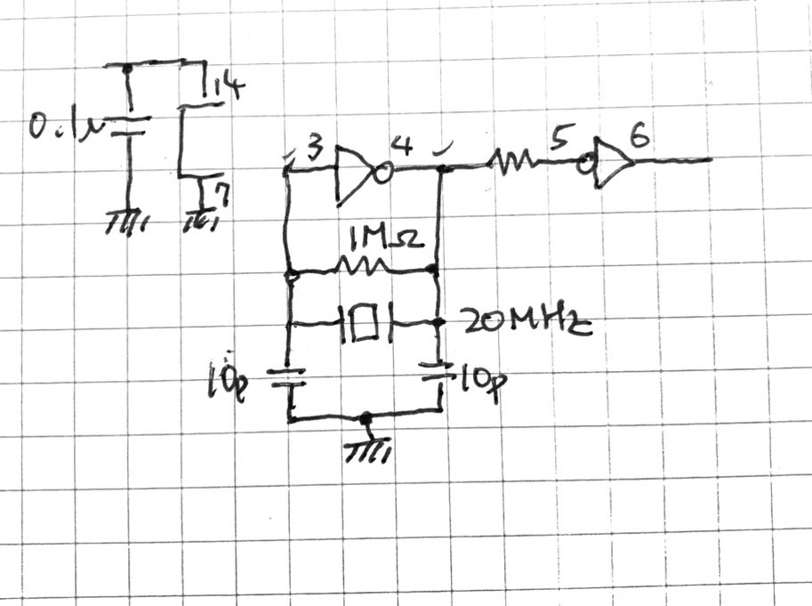
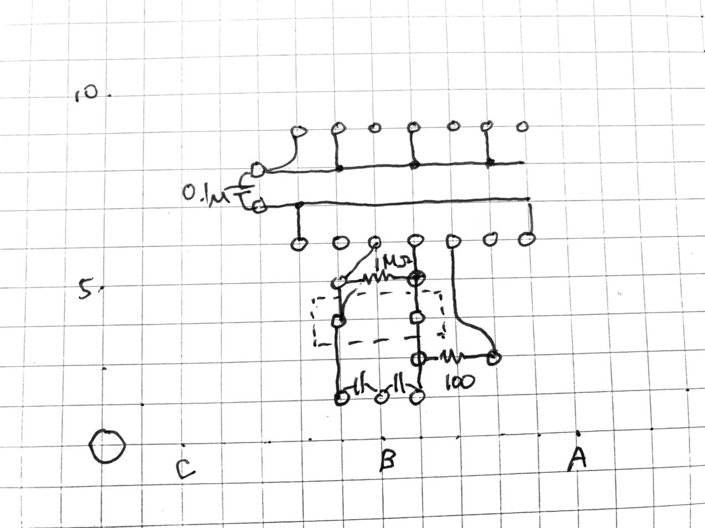

# TinyFreqCounter

A little 3 digit 7 segment LED display with a simple Frequency counter, for a companiou unit of retroPC SBC's.

可愛い3桁7セグメントLED表示器です。レトロCPU基板のCPUクロック周波数表示のために作りました。PIC18F27Q43のカウンタがいい感じで3種類あったので、外付けプリスケーラなしで1チップでできました。

3桁LEDディスプレイとPIC18Fの2チップ構成です。秋月C基板サイズ(72mm x 47mm)の上半分がLEDとPIC18Fチップで、下半分は蛇の目パターンにしてあります。簡単なセンサと組み合わせて無骨な温度計なんてのもありです。

レトロPCの外部クロック発生器を74HCU04と水晶でつくると、簡単な周波数カウンタとなります。

PICのファームウェアは https://github.com/tendai22/TinySeqCounter.git にあります。

## 周波数カウンタ

おおよそ100kHz～33MHzの範囲のクロックパルスを生成させ、CPUに食わせます。その時7セグLEDで周波数を表示させれば写真映えすると期待できます。

分解能として10進3桁、2進数で1024～2048の範囲の値を得て、そこから周波数3桁を定数を掛けたり割ったりして算出します。

周波数カウンタとしては、一定時間内のパルス数をカウントする方式です。測定時間は32.768msとします。を一定にしてプリスケーラを変えて測定終了し、結果を算出し表示します。1024～2048の範囲とは、10進数3桁に相当します。カウント後最下位ビットを見て「0捨1拾」して切りのいい数字にまとめます。

1MHz以上の範囲では、プリスケーラの分周数を次第に大きくしてオーバフローが収まり、カウント数が1024～2047の範囲になったところで測定終了、表示更新となります。

1MHz未満の範囲では、プリスケーラを1/1としてカウント数を32で割った値を周波数(kHz単位)とします。

## 7セグメントディスプレイ

なんの変哲もない素のダイナミック点灯です。1桁8msごとに更新して、ちらつきをなくしています。

## クロックジェネレータ

蛇の目部分に手配線で構成します。回路図と配線図は以下の通り。

 
図1: クロックジェネレータ回路図 
 
図2: パターン配線図

## 設計メモ

### 周波数カウンタ機能

まず、クロックパルスを数えるカウンタ、数える期間を算出するカウンタが必要になる。前者はTIM0, 後者をTIM1で行く。TIM0が持つ幅広い範囲のプリスケーラを活用することで、外付けプリスケーラが不要となった(4060を買っていたが)。

TIM1は測定期間を決めるタイマとして使う。Foscを4分周したものをTIM1に入れ、プリスケーラ1/8で16ビットカウンタとして使うと、16bitがあふれるまでの時間が32.768msとなり、これを測定期間とする。

入力クロックパルスの周波数をいくつか選び、分周比をいくらにすると32.768msの間に1024～2048パルスになるかを計算すると以下の表を得る。

|入力周波数|プリスケーラ 分周比|パルス幅|カウント|
|--:|--:|--:|--:|
|100MHz|1/2048|10.24us|1600|
|10MHz|1/256|25.6us|1280|
|1MHz|1/32|32us|1024|

100MHz～1MHzの範囲でプリスケーラを調整すると上の表を得る。
TIM0のプリスケーラ分周比は1/1から1/65536まで16段階で選べるので、この周波数範囲ならば10進数で有効数字3桁は問題なく確保できる。

1MHz～1kHzの範囲では、プリスケーラ分周比を1/1とする。すると、

|入力周波数|プリスケーラ 分周比|パルス幅|カウント|
|--:|--:|--:|--:|
|1000kHz|1/1|1us|32768|
|100kHz|1/1|10us|3276|
|10kHz|1/1|100us|327|
|1kHz|1/1|1000us|32|

となる。1kHz以下の精度は不要なので、この範囲では分周比1/1固定としてカウントを得ることにする。

### 7セグメントLEDダイナミック駆動

RC0-7をセグメントに割り当て、RB0-2を桁駆動に割り当てる。RC0-7側に電流制限抵抗(150ohmを選択)をつける。アノードコモン、カソードコモンどちらでもソフトで対応できると考える。

当初、周波数カウンタの測定期間32.768msを駆動周波数としてみたが、ちらつきが多く耐えられない。試行の結果、この1/4周期の8.192msでちらつきを抑えることができた。

TIM1を8.192msとして、4回ごとに測定を行うことにする。タイマがあと1つ(TIM2)使えるのでそれでダイナミック駆動することも考えたが、リフレッシュ処理の割り込みと測定周期が非同期となりはまり具合が予想できないので、リフレッシュ処理と測定のタイマを共通とし、一つの割り込み処理ルーチンの中で両処理を行うこととする。

### ピンアサイン

試作により周波数カウンタ機能とダイナミック駆動の処理を確認できたので、ピンアサインを確定させた。

|ピン|割り当て機能|説明|
|--|--|--|
|RB7,6|ICSPCLK, ICSPDAT|これは固定で他の割り当てはできない。他との共用も避けた。|
|RB5,4|TX1,RX1|シリアルポートをここに割り当てる。
|RB3|T0CKI|クロックパルスをここに入力する。74HCU04による発振器だけでなく、SBCのPICが生成するクロックをここにつないでもよい。
|RB0-2|LED DIG1-3|7セグLEDのコモン端子3本を割り当てる
|RC0-7|LED A-F|7セグLEDのセグメント7個と小数点1個を割り当てる

PIC18Fのピン割り当ての柔軟さにより、RA0-7に手を付けずに周波数カウンタが実現できた。

